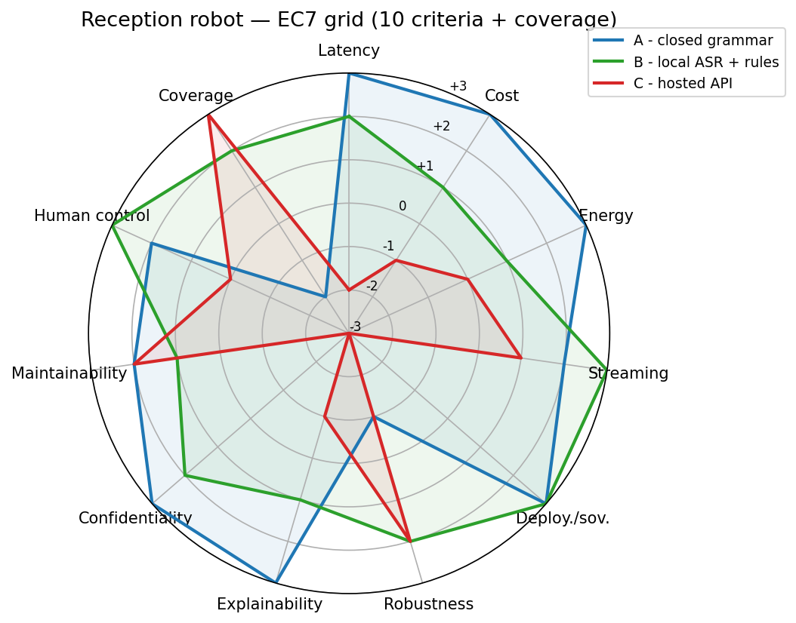

# todo1/grid.md — EC7 multicriteria grid: the reception robot

**Options.**
**A** — closed grammar: twenty fixed phrasings, matched on a small local box, no learning (the baseline).
**B** — a pre-trained speech recogniser run locally, plus rules on the resulting text.
**C** — a hosted speech-and-language API: audio and understanding both happen off-site.

Scale: −3 (strong inadequacy) to +3 (strong adequacy) — for Cost and Energy, +3 means *cheap and frugal*, not *large*.

## Grid: score (weight) and the one-sentence why, per option

| Criterion — weight, because | **A** — closed grammar | **B** — local ASR + rules | **C** — hosted API |
|---|---|---|---|
| **Latency** — w=5, because 200 people/h at peak and the case's own rule: show it heard within 1 s or voices overlap | **+3** — a local exact match runs in microseconds, far inside the 1 s bar | **+2** — local streaming ASR is comfortably under 1 s but noisier than a fixed match | **−2** — a network round trip risks crossing 1 s under load or a weak link |
| **Total cost** — w=2, because the case gives no budget figure, only a two-person IT team | **+3** — a one-off local script, no licence, no per-call fee | **+1** — an upfront model/box cost, but no per-call fee afterwards | **−1** — cheap per call, but the bill scales with every query, forever |
| **Energy** — w=1, because the case states no energy constraint at all | **+3** — a small box doing string matching draws almost nothing | **+1** — local inference needs real on-site compute, more draw than A | **0** — the draw happens off-site; nothing in the case scores it either way |
| **Streaming vs complete info** — w=5, because the "heard within 1 s" rule needs an incremental signal, not a finished answer | **+2** — matches short fixed templates fast, but is not true streaming | **+3** — a modern local ASR emits partial output as speech arrives | **+1** — can stream too, but only after audio has already left the building |
| **Deployment & sovereignty** — w=5, because IT blocks unapproved outbound traffic and approval takes about a month | **+3** — fully on-device, nothing to approve, works with no network link | **+3** — stays on the hall's own hardware, no new outbound service needed | **−3** — needs a newly-approved outbound service; dead on arrival for a fast rollout |
| **Robustness** — w=4, because the glass ceiling rings and the coffee machine masks input for 30 s bursts | **−1** — exact matching has no acoustic tolerance; noise makes it miss rather than degrade | **+2** — a trained recogniser tolerates reverb and noise better than a fixed script | **+2** — plausibly the most noise-tolerant model, but this can't be verified before approval |
| **Explainability** — w=3, because the supervisor must justify the exact answer given last Tuesday | **+3** — an exact phrase list; the "why" is a direct table lookup | **+1** — transcript + fired rule is traceable; the ASR step itself is not | **−1** — not inspectable, and a silent vendor model update can break replay entirely |
| **Confidentiality** — w=4, because the open mic hears conversations never addressed to it | **+3** — audio is matched and discarded on the box; nothing to leak | **+2** — stays on-site, but a local transcript log still needs guarding | **−3** — sends non-consenting bystanders' speech to a third party |
| **Maintainability** — w=4, because a two-person IT team maintains whatever gets installed | **+2** — adding an entry is a text edit; more entries still means more manual upkeep | **+1** — a model plus a runtime on a box: heavier, but still fully in-house | **+2** — the vendor handles upgrades — lightest day-to-day load, if it were ever approved |
| **Human control** — w=5, because failing to fetch a human is explicitly what gets the robot switched off | **+2** — a guaranteed trigger, but only for its twenty exact phrasings | **+3** — free phrasing plus a hard keyword override catches far more real requests | **0** — as capable in principle, but the outcome depends on a link nobody here controls |
| **Coverage of the user population** *(additional)* — w=3, because ~30 different visitors an hour is not a uniform crowd | **−2** — assumes every visitor already knows one of the twenty magic phrasings | **+2** — a general recogniser handles varied accents and phrasings better | **+3** — the broadest training data of the three, its clearest strength |

## Weighted totals

Sum of weights = 41 (so the theoretical range is −123 to +123).

| | **A** | **B** | **C** |
|---|---|---|---|
| **Weighted score** | 78 | **87** | −12 |

## Radar

The shapes say more than the totals: **A** is a wide, confident disc everywhere except robustness and coverage — spiky where a script can't bend. **C** is the mirror image: strong on coverage and robustness, hollow and often negative exactly where the hall's own constraints (deployment, confidentiality, latency) bite. **B** is the roundest of the three — never the single best on any one axis, never badly hollow on any either, which is why it leads on the total without depending on one fragile strength.

## Recommendation (5 lines)

1. Recommend **Option B** — local pre-trained recogniser + rule-based intent layer: best weighted score (87/123) and clear of every knock-out below.
2. It wins specifically because it needs no newly-approved outbound service, keeps all audio (bystander speech included) on-site, and still acknowledges within the 1 s bar.
3. **Option A** (78) is a legitimate fallback if B's model can't be procured before the deadline; its one real weakness is the 20-phrase ceiling on how visitors actually talk.
4. **Option C** (−12) is not only lowest-scoring, it is independently blocked on deployment and confidentiality grounds — no future accuracy gain fixes an approval delay or a sovereignty violation.
5. Residual risk to manage in B: the "call a human" rule must be a hard keyword override sitting outside the general classifier's confidence threshold, since a missed escalation — not a wrong room — is the failure the case says gets the robot switched off.

## Knock-out

**Criterion: Deployment & sovereignty.** The case gives a number: IT approval for a new outbound service takes about **a month**. Where the case is silent I decide: the robot must go live within **two weeks** of installation — reasonable for a small, two-person IT team commissioning a single hall kiosk rather than running a month-long procurement alongside their existing work. Option C's speech-and-language calls are, by construction, a new unapproved outbound service, so C cannot be live on day one under this deadline, regardless of any other score it earns. This is a hard blocker on the critical path, not a soft latency or robustness penalty.

A second, independent knock-out reaches the same option: **Confidentiality.** The case states the microphone "picks up conversations that are not addressed to it." Any option whose critical path streams that hall audio to an external party is removed on this ground alone — bystanders never consented to have their voices leave the building — and this would hold even if IT fast-tracked the approval above.

Because Option C's weighted score (−12) was already last, neither knock-out changes who wins: B was already ahead of A by 9 points and of C by 99. What the knock-outs add is certainty that C could never be patched into contention later — no improvement to its transcription accuracy repairs an approval delay or a sovereignty violation, so its exclusion is structural, not a scoring artefact.

I retain option B, and I accept that its speech-recognition step is not fully inspectable (the supervisor can retrieve the transcript and the rule it fired, but not why the model heard those particular words) in order to get a system that understands free-form phrasing well enough to catch far more real "get me a human" requests than a twenty-phrase grammar, while running entirely on hardware the two-person IT team already controls.

## The context moves

*Same three options, same ten criteria (+coverage), one change: the building becomes a consumer mobile application. No hall, no IT department, a million users, same three kinds of question.*

**Which weight moves first, and why?** Total cost moves first, and it moves for a purely arithmetic reason rather than a judgment call: at a million users, every cent Option C charges per call stops being a rounding error and becomes the dominant recurring line item, so I would raise its weight from 2 to something like 5. Two other weights move as a consequence rather than a cause: Deployment & sovereignty falls (from 5 toward 2), because the single fact that earned it a 5 — a two-person IT department blocking unapproved outbound traffic — no longer exists once anyone can integrate a cloud API on their own schedule; and Coverage of the user population rises (from 3 toward 5), because "a few hundred daily visitors" becomes "any accent, dialect or language among a million people," which is now central rather than incidental.

**Does the winner change?** No — Option B still wins, and by a wider margin. Raising Cost's weight hurts Option C, which was already worst there. Lowering Deployment's weight helps Option C least, since it is still negative on that axis, just less heavily punished. What actually decides it is that a mobile context amplifies exactly what already made B strong: "local" now means on-device recognition, so B's marginal cost per user is zero (unlike C's, which scales with usage) and its voice data never leaves the phone — a stronger privacy story than the hall ever needed, and one app stores increasingly require. Option A's weak point gets worse, not better: a general public expects a conversational assistant, not a twenty-phrase lobby script. That the winner survives a real weight change tells me the original ranking wasn't an artefact of the hall's specific facts (an approval process, physical bystanders) — it was already tracking a structural advantage (on-device, low marginal cost, decent generalisation) that would show up in a different setting too.

**Which of the three constraints survives, and which stops existing?** The 1-second "show it's heard" constraint survives essentially unchanged, and if anything gets stricter: a phone app competes for attention against every other app on the device, and a user who isn't shown a response quickly just leaves, with no visible queue of other people to make them wait. The "call a human" escalation constraint survives in spirit but changes shape: there is no reception desk or pager to trigger, so it becomes "hand off to a live support channel," and the case's "switched off" consequence becomes "uninstalled." The constraint that stops existing outright is the IT-approval delay: with no internal network to protect, nobody blocks the app's outbound calls, so the fact that did the most damage to Option C in the hall has no equivalent here — though its removal is exactly why the now much larger Cost gap becomes the new reason C loses; the case gets differently hard for C, not easier.
