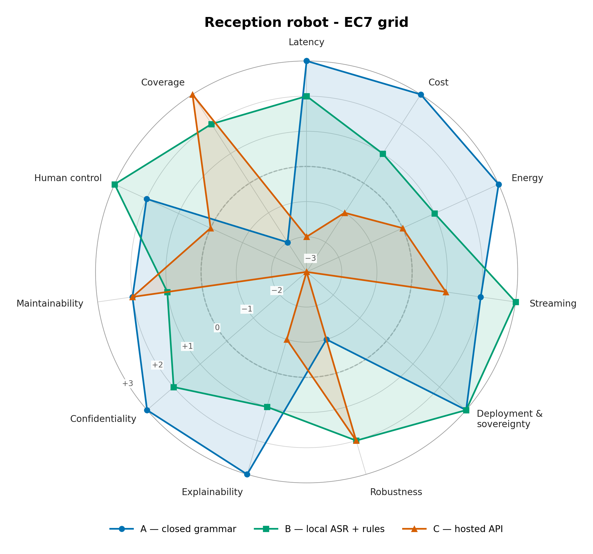

# Assignment 1 — Choose before you build: the reception robot

## Options compared

- **A**: a closed grammar of twenty phrasings, on a small box in the hall. Baseline: no learning at all.
- **B**: a pre-trained recogniser run locally, plus rules on the text.
- **C**: a hosted speech and language API.

What I decided where the case is silent:

- TODO: which B I score (which recogniser, on what box)
- TODO: what C does (only transcribe, or also write the answer)
- TODO: the installation date, and anything else I assumed

## Scores (−3 to +3: how adequate each option is for this need)

TODO: paste the "Scores" table printed by grid_radar.py

### One sentence per score

**Latency**
- A (TODO): TODO, with the latency I assume, in ms
- B (TODO): TODO
- C (TODO): TODO

**Total cost**
- A (TODO): TODO
- B (TODO): TODO
- C (TODO): TODO

**Energy**
- A (TODO): TODO
- B (TODO): TODO
- C (TODO): TODO

**Processing mode (streaming vs complete information)**
- A (TODO): TODO
- B (TODO): TODO
- C (TODO): TODO

**Deployment and sovereignty**
- A (TODO): TODO
- B (TODO): TODO
- C (TODO): TODO

**Robustness**
- A (TODO): TODO
- B (TODO): TODO
- C (TODO): TODO

**Explainability**
- A (TODO): TODO
- B (TODO): TODO
- C (TODO): TODO

**Confidentiality**
- A (TODO): TODO
- B (TODO): TODO
- C (TODO): TODO

**Maintainability**
- A (TODO): TODO
- B (TODO): TODO
- C (TODO): TODO

**Human control**
- A (TODO): TODO
- B (TODO): TODO
- C (TODO): TODO

## Weights (0 to 5), each with a because

| Criterion | Weight | Because (a fact of the case, or a value) | Value it serves |
|---|---:|---|---|
| Latency | TODO | TODO | human agency and oversight |
| Total cost | TODO | TODO | none: an economic constraint |
| Energy | TODO | TODO | environmental well-being |
| Processing mode | TODO | TODO | human agency and oversight |
| Deployment and sovereignty | TODO | TODO | privacy and data governance |
| Robustness | TODO | TODO | technical robustness and safety |
| Explainability | TODO | TODO | transparency |
| Confidentiality | TODO | TODO | privacy and data governance |
| Maintainability | TODO | TODO | accountability |
| Human control | TODO | TODO | human agency and oversight |

## Weighted totals

TODO: paste the "Weighted totals" table and the ranking line printed by grid_radar.py

## Radar

## Recommendation (five lines)

1. TODO: the option I recommend, and its weighted total
2. TODO: the criteria where it earns its points, and the facts behind them
3. TODO: what it gives up
4. TODO: the main residual risk (technical, human or societal)
5. TODO: how I would reduce or check that risk

## A criterion that works against its value

TODO: one sentence

## Knock-out

| Knock-out criterion, with its number | Fact of the case it comes from | A | B | C |
|---|---|---|---|---|
| TODO | TODO | passes / removed | passes / removed | passes / removed |

TODO: which option is removed and why; if none is, the value at which the ranking would change, and which option would then win.

TODO: end this section with exactly one of these two sentences, filled in, as its very last line:
"Option _ has the best weighted score but is eliminated, because _."
"I retain option _, and I accept _ in order to get _."

## The context moves

**Which weight moves first, and why?** TODO

**Does the winner change?** TODO

**Which of my three constraints survives, and which one stops existing?** TODO
